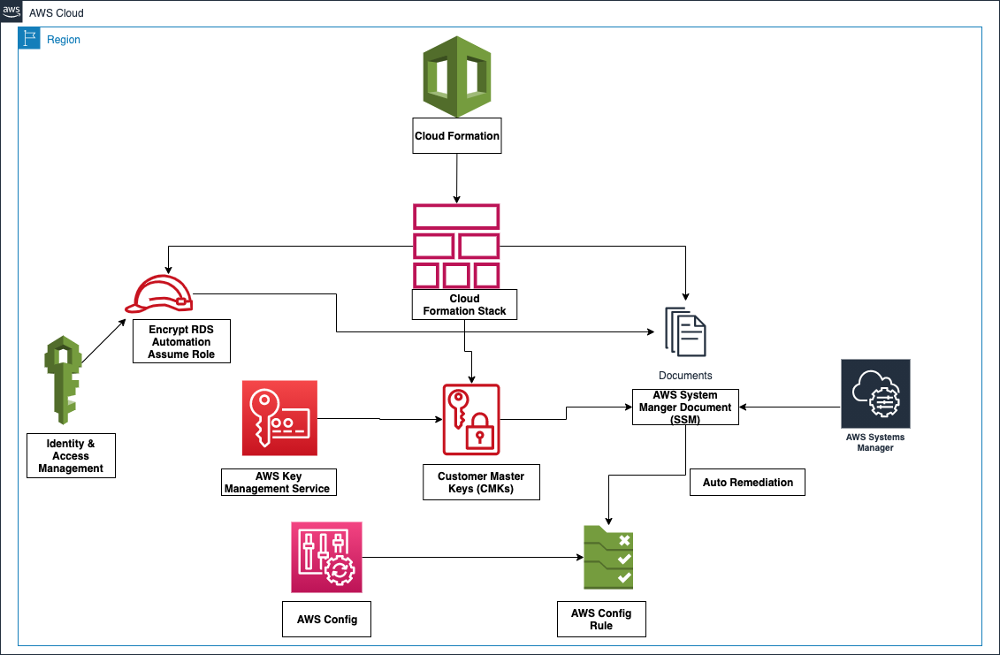

# Automatically remediate unencrypted resources

These samples describe how to automatically remediate uenencrypted resources such as RDS and EBS volumes.

## Automatically remediate unencrypted RDS Instances and Clusters using customer master keys

This [sample](rds) describes how to automatically remediate unencrypted RDS Instances and Clusters. Amazon RDS encrypted DB instances provide an additional layer of data protection by securing your data from unauthorized access to the underlying storage. You can use Amazon RDS encryption to increase data protection of your applications deployed in the cloud, and to fulfill compliance requirements for encryption at rest.

The sample solution can be deployed using the AWS CloudFormation stack or AWS Cloud Development Kit (AWS CDK), which create remediation using Systems Manger Automation Document (SSM) that will unencrypted RDS instances and clusters by using the specific Customer master keys (KMS key) if not initially encrypted when created.
 
Once the resources are remediated, ensure preventive enforcement via Service control policies to deny DB instances and cluster creation in future without encryption.  

## Security

See [CONTRIBUTING](CONTRIBUTING.md#security-issue-notifications) for more information.

## License

This library is licensed under the MIT-0 License. See the LICENSE file.

